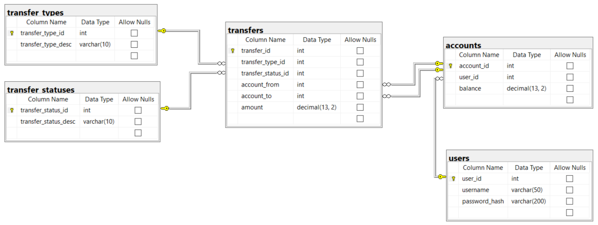

## Sample screens

### Use case 3: Current balance
```
Your current account balance is: $9999.99
```

### Use case 4: Send TE Bucks
```
-------------------------------------------
Users
ID          Name
-------------------------------------------
313         Bernice
54          Larry
---------

Enter ID of user you are sending to (0 to cancel):
Enter amount:
```

### Use case 5: View transfers
```
-------------------------------------------
Transfers
ID          From/To                 Amount
-------------------------------------------
23          From: Bernice          $ 903.14
79          To:    Larry           $  12.55
---------
Please enter transfer ID to view details (0 to cancel): "
```

### Use case 6: Transfer details
```
--------------------------------------------
Transfer Details
--------------------------------------------
 Id: 23
 From: Bernice
 To: Me Myselfandi
 Type: Send
 Status: Approved
 Amount: $903.14
```

### Use case 7: Requesting TE Bucks
```
-------------------------------------------
Users
ID          Name
-------------------------------------------
313         Bernice
54          Larry
---------

Enter ID of user you are requesting from (0 to cancel):
Enter amount:
```

### Use case 8: Pending requests
```
-------------------------------------------
Pending Transfers
ID          To                     Amount
-------------------------------------------
88          Bernice                $ 142.56
147         Larry                  $  10.17
---------
Please enter transfer ID to approve/reject (0 to cancel): "
```

### Use case 9: Approve or reject pending transfer
```
1: Approve
2: Reject
0: Don't approve or reject
---------
Please choose an option:
```

## Database schema



### Users table

The `users` table stores the login information for users of the system.

| Field           | Description                                                                    |
| --------------- | ------------------------------------------------------------------------------ |
| `user_id`       | Unique identifier of the user                                                  |
| `username`      | String that identifies the name of the user; used as part of the login process |
| `password_hash` | Hashed version of the user's password                                          |

### Accounts table

The `accounts` table stores the accounts of users in the system.

| Field           | Description                                                        |
| --------------- | ------------------------------------------------------------------ |
| `account_id`    | Unique identifier of the account                                   |
| `user_id`       | Foreign key to the `users` table; identifies user who owns account |
| `balance`       | The amount of TE bucks currently in the account                    |

### Transfer types table

The `transfer_types` table stores the types of transfers that are possible.

| Field                | Description                             |
| -------------------- | --------------------------------------- |
| `transfer_type_id`   | Unique identifier of the transfer type  |
| `transfer_type_desc` | String description of the transfer type |

There are two types of transfers:

| `transfer_type_id` | `transfer_type_desc` | Purpose                                                                |
| ------------------ | -------------------- | ---------------------------------------------------------------------- |
| 1                  | Request              | Identifies transfer where a user requests money from another user      |
| 2                  | Send                 | Identifies transfer where a user sends money to another user           |

### Transfer statuses table

The `transfer_statuses` table stores the statuses of transfers that are possible.

| Field                  | Description                               |
| ---------------------- | ----------------------------------------- |
| `transfer_status_id`   | Unique identifier of the transfer status  |
| `transfer_status_desc` | String description of the transfer status |

There are three statuses of transfers:

| `transfer_status_id` | `transfer_status_desc` |Purpose                                                                                 |
| -------------------- | -------------------- | ---------------------------------------------------------------------------------------  |
| 1                    | Pending                | Identifies transfer that hasn't occurred yet and requires approval from the other user |
| 2                    | Approved               | Identifies transfer that has been approved and occurred                                |
| 3                    | Rejected               | Identifies transfer that wasn't approved                                               |

### Transfers table

The `transfer` table stores the transfers of TE bucks.

| Field                | Description                                                                                     |
| -------------------- | ----------------------------------------------------------------------------------------------- |
| `transfer_id`        | Unique identifier of the transfer                                                               |
| `transfer_type_id`   | Foreign key to the `transfer_types` table; identifies type of transfer                          |
| `transfer_status_id` | Foreign key to the `transfer_statuses` table; identifies status of transfer                     |
| `account_from`       | Foreign key to the `accounts` table; identifies the account that the funds are being taken from |
| `account_to`         | Foreign key to the `accounts` table; identifies the account that the funds are going to         |
| `amount`             | Amount of the transfer                                                                          |

## How to set up the database

In the database folder, you'll find the database creation scripts and a shell script called `create.sh`. Run `./create.sh` from the database folder in Bash to create the database.

## Authentication

The user registration and authentication functionality for the system has already been implemented. If you review the login code, you'll notice that after successful authentication, an instance of `AuthenticatedUser` is stored in the `currentUser` member variable of `App`. The user's authorization token—meaning JWT—can be accessed from `App` as `currentUser.getToken()`.

When the use cases refer to an "authenticated user", this means a request that includes the token as a header. You can also reference other information about the current user by using the `User` object retrieved from `currentUser.getUser()`.
